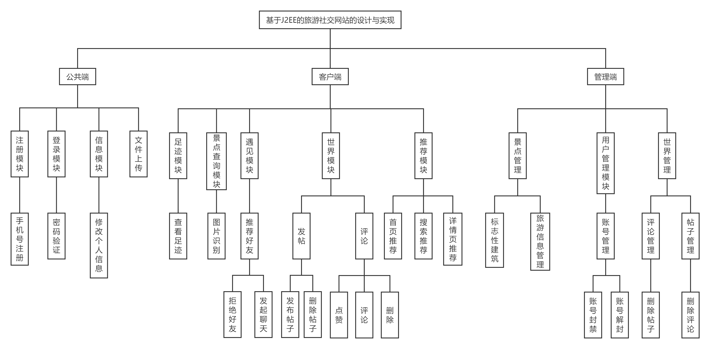
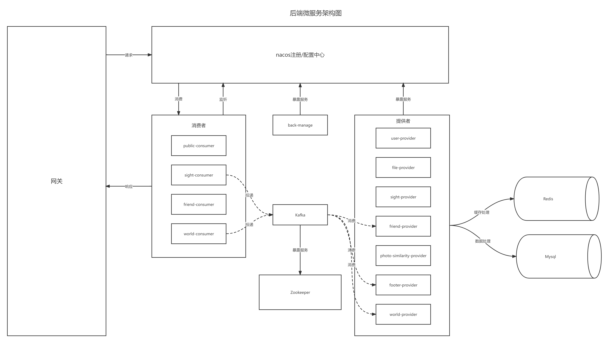

# FunTour旅游社交系统
系统总体功能模块图

系统架构图

## 基本框架
- SpringBoot 2.6.6
- SpringCloud 2021.0.1
- SpringCloudAlibaba 2.2.1.RELEASE(这个版本并不是官方推荐的版本)

## 使用技术 
- 网关：GateWay
- 远程调用：Dubbo
- 注册中心/配置中心：Nacos
- 数据源：Druid 1.2.2
- 数据库连接：Mybatis 2.2.0
- 日志：Slf4j + Log4j2
- 序列化：FastJosn
- 令牌：JWT
- API文档：Swagger2
- 消息中间件：Kakfa